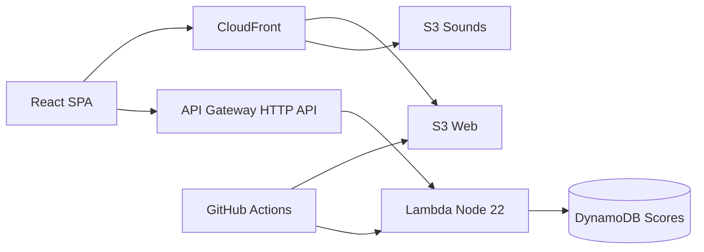

# Animal Sound Game

A browser-based game where players imitate animal sounds and get an instant score. Built for a school careers-day demo — kids pick an animal, hear a reference sound, record their imitation, and see how they scored. Scores are saved to a DynamoDB-backed leaderboard via a Lambda API.

## Animals

Cow, dog, cat, sheep, and duck — each with a hand-tuned scoring profile for **human imitation**, not real animal recordings.

## How to run locally

```bash
npm install
npm run dev
```

Open [http://localhost:5173](http://localhost:5173). Microphone access requires HTTPS in production; `localhost` works for development.

Without `VITE_API_URL`, the leaderboard falls back to **local storage** on your device. Point the app at a deployed API to test cloud submissions:

```bash
VITE_API_URL=https://your-api-id.execute-api.eu-west-2.amazonaws.com npm run dev
```

### Other commands

```bash
npm run build    # production build
npm run lint     # TypeScript check (all workspaces)
npm run test     # unit tests (scoring + API validation)
npm run synth    # validate CDK stacks compile
```

## Project structure

```
animal-sound-game/
├── apps/web/              # Vite + React + TypeScript SPA
├── services/api/          # Lambda handlers (leaderboard CRUD)
├── infra/                 # AWS CDK stacks (Web, API, CI/OIDC)
├── assets/
│   ├── profiles/          # Per-animal scoring profiles (JSON)
│   └── sounds/            # Reference animal sounds (MP3)
├── .github/workflows/     # CI/CD pipeline
└── package.json           # npm workspaces root
```

## How scoring works

1. Record up to 5 seconds of audio via the Web Audio API.
2. Extract duration, pitch contour, energy envelope, and MFCCs using [meyda](https://meyda.js.org/).
3. Compare against the animal's scoring profile using DTW and weighted similarity.
4. Apply **Kid** or **Grown-up** mode multipliers (generous vs strict).

Profiles live in `assets/profiles/` and are generated from the reference sounds in `assets/sounds/`. Re-run `npm run generate-profiles` after swapping sound files to refresh duration, pitch, envelope, and MFCC targets.

## Player modes

| Mode | Score floor | Multiplier |
|------|-------------|------------|
| Kid | ~50% | `min(100, raw × 1.25 + 10)` plus ±8% jitter |
| Grown-up | ~35% | Raw score plus ±5% jitter |

Full architecture and implementation plan: [docs/plan.md](docs/plan.md).

## Architecture



| Layer | Service |
|-------|---------|
| Frontend | S3 + CloudFront (SPA + `/sounds/*` assets) |
| API | API Gateway HTTP API + Lambda (Node 22) |
| Data | DynamoDB on-demand, 7-day TTL |
| IaC | AWS CDK (TypeScript) |
| CI/CD | GitHub Actions with OIDC |

**API endpoints**

- `GET /leaderboard?animal=cow&limit=10&mode=child` — top scores (optional filters)
- `GET /leaderboard?limit=20` — global top 20
- `POST /scores` — `{ nickname, animal, score, mode }` (trusts client score in v1)

## How to deploy

### One-time AWS setup

1. Install AWS CLI and CDK CLI (`npm install -g aws-cdk`).
2. Configure AWS credentials locally (`aws configure` or SSO).
3. Bootstrap CDK in your account/region:

   ```bash
   cd infra
   npx cdk bootstrap aws://963777545862/eu-west-2
   ```

4. Deploy the **CI stack first** to create the GitHub OIDC role (only needed once):

   ```bash
   npx cdk deploy AnimalSoundGame-CiStack
   ```

5. Set GitHub repository secrets (Settings → Secrets and variables → Actions):
   - **`AWS_ROLE_ARN`** — `arn:aws:iam::963777545862:role/AnimalSoundGame-GitHubActionsDeploy`
   - **`AWS_REGION`** — `eu-west-2`

### Deploy via GitHub Actions

Push to `main`. The workflow runs lint, test, and `cdk synth` on every PR; on merge it deploys the API stack, builds the web app with the live API URL, then deploys the web stack.

### Manual deploy

```bash
npm run build
cd infra
npx cdk deploy AnimalSoundGame-ApiStack
export VITE_API_URL=$(aws cloudformation describe-stacks \
  --stack-name AnimalSoundGame-ApiStack \
  --query "Stacks[0].Outputs[?OutputKey=='ApiUrl'].OutputValue" \
  --output text)
VITE_API_URL=$VITE_API_URL npm run build -w @animal-sound-game/web
npx cdk deploy AnimalSoundGame-WebStack
```

Tear down after the event: `cd infra && npx cdk destroy --all`

## Future improvements

### Server-side score validation

Re-run the scoring formula in Lambda on submit. POST a compact feature vector (~2 KB, not raw audio) alongside the claimed score; reject submissions where `|clientScore - serverScore| > 10`. Prevents DevTools score hacking while keeping uploads tiny.

### Other ideas

- Custom domain on CloudFront
- WAF / API Gateway rate-limiting hardening
- AI "funny comment" bonus round (not for core scoring)
- Re-calibrate profiles from human imitation recordings (instead of reference animal sounds)

## License

MIT — animal sound assets should be royalty-free (CC0).
