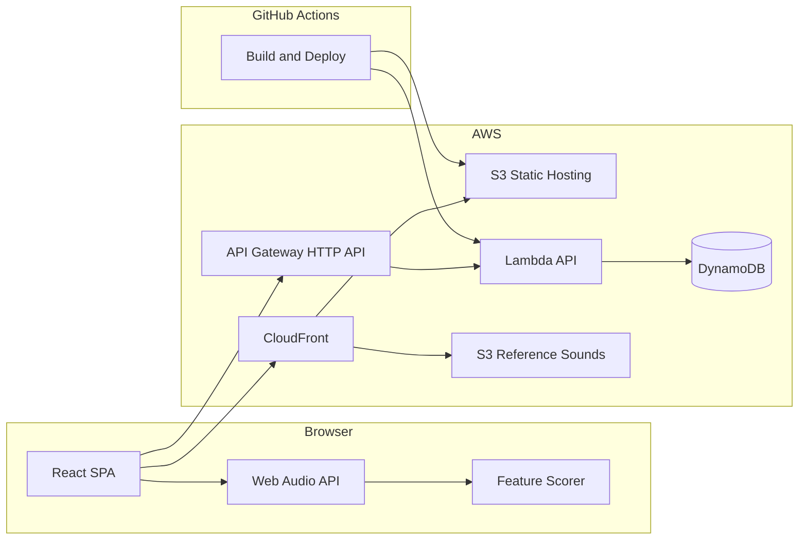
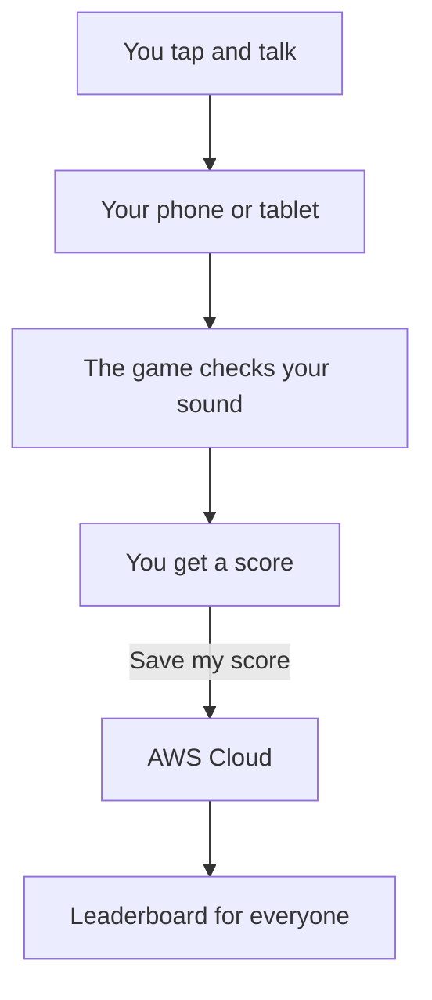

# Animal Sound Imitation Game — Architecture Plan

## What we're building

A two-screen React web app:

1. **Play screen** — choose **Child** or **Grown-up** mode, pick 1 of 5 animals, hear the reference sound, record your imitation, get an instant % score (child mode is more generous), optionally submit to the leaderboard.
2. **Leaderboard screen** — split layout: **left panel** shows top scores per animal (or global); **right panel** shows a child-friendly architecture diagram and plain-language explanation of how the app works (careers-day talking point).



---

## Player modes: Child vs Grown-up

Players choose a mode at the start of each round (or via a persistent toggle on the home screen). Both modes use the **same underlying scoring algorithm**; child mode applies a generosity multiplier so younger players feel successful.

| Aspect | Child mode | Grown-up mode |
|--------|------------|---------------|
| Score floor | ~50% | ~35% |
| Score multiplier | `min(100, rawScore × 1.25 + 10)` | `rawScore` (no boost) |
| Jitter | ±8% (more variation, feels playful) | ±5% |
| Encouraging copy | Extra praise ("Amazing moo!") | Standard praise |
| Leaderboard tag | `mode: "child"` stored in DynamoDB | `mode: "grownup"` stored in DynamoDB |

**Leaderboard filtering:** default view shows all scores; optional filter tabs for "Kids" / "Grown-ups" / "Everyone". This keeps the demo honest — grown-ups can still compete fairly among themselves.

**Implementation:** a `PlayerMode` enum (`child` | `grownup`) passed into the scorer; multiplier constants live in `apps/web/src/scoring/modes.ts` for easy tuning during calibration.

---

## Q1 — Infrastructure approach (IaC)

### Recommendation: **AWS CDK with TypeScript** (monorepo)

| Layer    | Service                                     | Why                                                                   |
| -------- | ------------------------------------------- | --------------------------------------------------------------------- |
| Frontend | S3 + CloudFront                             | Standard, cheap SPA hosting; HTTPS required for microphone access     |
| API      | API Gateway **HTTP API** + Lambda (Node 22) | Minimal ops, fits leaderboard CRUD, good careers-day story            |
| Data     | DynamoDB (on-demand)                        | Scales to zero, pennies for a school event                            |
| Assets   | S3 bucket (reference animal sounds)         | CDN-cached audio files, easy to swap sounds                           |
| IaC      | **AWS CDK v2 (TypeScript)**                 | Same language as React; one repo; `cdk deploy` is a great demo moment |
| CI/CD    | **GitHub Actions**                          | Lint, test, and deploy on merge to `main`; strong careers-day story   |

**Repo layout (proposed):**

```
animal-sound-game/
├── apps/web/              # Vite + React + TypeScript
├── services/api/          # Lambda handlers (leaderboard CRUD)
├── infra/                 # CDK stacks
│   ├── lib/
│   │   ├── web-stack.ts   # S3, CloudFront, asset bucket
│   │   └── api-stack.ts   # API GW, Lambda, DynamoDB, IAM
│   └── bin/app.ts
├── assets/sounds/         # cow.mp3, dog.mp3, etc. (royalty-free)
├── .github/
│   └── workflows/
│       └── deploy.yml     # CI/CD pipeline
├── README.md              # includes "Future improvements" section
└── package.json           # npm workspaces
```

**CDK stacks (2 stacks for clean separation):**

- `WebStack` — S3 origin bucket, CloudFront distribution with OAC, optional custom domain later.
- `ApiStack` — DynamoDB table, Lambda functions, HTTP API with CORS locked to the CloudFront domain.

### CI/CD — GitHub Actions

**Workflow file:** `.github/workflows/deploy.yml`

**On pull request:**

- `npm ci` (root workspace)
- `npm run lint` and `npm run test`
- `cdk synth` (validates infra compiles; no deploy)

**On push to `main`:**

- Run PR checks above
- Build React app (`apps/web`)
- `cdk deploy --all --require-approval never` (uses OIDC — no long-lived AWS keys in GitHub)

**AWS auth:** configure GitHub OIDC provider + IAM role in CDK (`WebStack` or a dedicated `CiStack`). Store only the role ARN as a GitHub repo secret/variable (`AWS_ROLE_ARN`); region via `AWS_REGION`.

**Careers-day demo angle:** show a green GitHub Actions run → live site updates. "When I push code, robots test it and put it on the internet."

**Estimated cost (school-day traffic, ~50–200 plays):** effectively **$0–2/month** on free tier. Tear down with `cdk destroy` after the event.

**Alternatives considered:** see prior IaC comparison (CDK chosen over Terraform, SAM, Amplify).

---

## Q2 — How to compare sounds

### The key insight (read this first)

You are **not** comparing "human says moo" to "real cow recording." Those are acoustically very different. If you naively compare waveforms or spectra against the animal MP3, scores will be demoralisingly low.

**Design choice:** store a **scoring profile per animal** tuned for _human imitation_ — either hand-tuned acceptable ranges, or pre-recorded "gold standard" kid-friendly imitations as the comparison target.

### Recommendation: **Browser-side algorithmic scoring only**

| Approach                | Pros                                                                                            | Cons                                    | Fit              |
| ----------------------- | ----------------------------------------------------------------------------------------------- | --------------------------------------- | ---------------- |
| **Browser algorithmic** | Instant feedback, no upload latency, works offline after load, zero API cost, great UX for kids | Client can fake scores on leaderboard   | **Ship this**    |
| **Lambda algorithmic**  | Tamper-resistant                                                                                  | Upload latency, extra complexity        | **Future improvement** (see README) |
| **AI (Bedrock, etc.)**  | "Wow" factor                                                                                    | Slow, costly, inconsistent              | **Skip**         |

### Scoring algorithm (browser, ~100 lines of logic)

Use the **Web Audio API** + a small feature library ([meyda](https://meyda.js.org/) is a good fit).

**Per recording, extract:**

1. **Duration** — length in seconds
2. **Pitch contour** — fundamental frequency over time (YIN/autocorrelation via meyda)
3. **Energy envelope** — RMS loudness over time
4. **Spectral shape** — MFCCs (mel-frequency cepstral coefficients) averaged over frames

**Compare user recording to the animal's scoring profile:**

```
rawScore = weighted average of:
  - durationSimilarity     (weight ~15%)
  - pitchRangeOverlap      (weight ~25%)
  - envelopeCorrelation    (weight ~25%)
  - mfccCosineSimilarity   (weight ~35%)

finalScore = applyModeMultiplier(rawScore, playerMode)
```

Use **Dynamic Time Warping (DTW)** on pitch/envelope sequences if durations differ.

**Make it fun, not forensic:**

- Mode-specific floors and multipliers (see Player modes above)
- Show encouraging copy: "Great moo!", "Almost purr-fect!"
- Include a **"Practice mode"** that scores but doesn't submit

### Server-side validation — deferred

For the initial release, `POST /scores` **trusts the client-reported score**. This keeps the API simple and latency low.

Document the following in **README.md → Future improvements**:

> **Server-side score validation:** Re-run the scoring formula in Lambda on submit. POST a compact feature vector (~2 KB, not raw audio) alongside the claimed score; reject submissions where `|clientScore - serverScore| > 10`. Prevents DevTools score hacking while keeping uploads tiny.

**Do not use AI** for core scoring.

### Reference audio assets

- Use **royalty-free** sounds (Freesound.org with CC0, or record your own with the kid).
- Store profiles as JSON in the repo (`assets/profiles/cow.json`), generated once by a small Node script.

---

## Leaderboard screen — split panel with architecture explainer

The leaderboard is a **two-column layout** (stacks vertically on mobile):

### Left panel — Leaderboard

- Top scores table: rank, nickname, animal emoji, score, mode badge (Kid / Grown-up)
- Filter tabs: Everyone | Kids | Grown-ups | per-animal
- Auto-refresh every 30 seconds (or manual refresh button)

### Right panel — "How it works" (careers-day content)

Child-friendly explanation alongside a simplified architecture diagram. Content is **static React components** (not fetched from an API) so it always renders.

**Diagram (in-app, simplified mermaid or SVG):**



**Child-friendly copy (example — tune during polish):**

1. **You make a sound** — "When you press record, your device listens through the microphone — just like a voice memo!"
2. **The game listens** — "The game compares your sound to what the animal should sound like and gives you a score out of 100."
3. **Your score goes to the cloud** — "If you save your score, it travels over the internet to a computer in Amazon's cloud (AWS). That's a data centre full of servers — like a giant filing cabinet for the internet."
4. **Everyone sees the leaderboard** — "The leaderboard shows the best scores from everyone playing today. Your nickname is all we save — no photos, no real names."

**Grown-up toggle:** a small "Tell me more" expandable section with technical labels (React, S3, CloudFront, API Gateway, Lambda, DynamoDB, GitHub Actions) for teachers/parents.

**Component:** `apps/web/src/pages/LeaderboardPage.tsx` with `LeaderboardTable` + `HowItWorksPanel` children.

---

## Q3 — Unknown unknowns (and mitigations)

### School / device realities

| Risk                          | Mitigation                                                                                                     |
| ----------------------------- | -------------------------------------------------------------------------------------------------------------- |
| **Microphone requires HTTPS** | CloudFront provides HTTPS automatically                                                                        |
| **iOS Safari quirks**         | Test on iPad; use `MediaRecorder` with `audio/mp4` fallback; provide a "Tap to allow microphone" primer screen |
| **Noisy classroom**           | Show a "quiet moment" countdown before recording; use noise gate on RMS threshold                              |
| **Shy kids / broken mic**     | **Demo mode**: tap buttons to simulate a score                                                                 |
| **Shared school devices**     | Don't persist recordings; only store score + nickname + mode                                                   |

### Privacy and safety

| Risk                    | Mitigation                                                                                                         |
| ----------------------- | ------------------------------------------------------------------------------------------------------------------ |
| **Child data (GDPR)**   | **Nickname only**, no real names; privacy notice; DynamoDB TTL (7 days)                                            |
| **Leaderboard abuse**   | Rate limit API (API GW throttling); max 3 submissions per nickname per animal per hour                             |
| **Offensive nicknames** | Basic blocklist in Lambda                                                                                          |
| **Score cheating**      | Accepted for v1; document server-side validation as README future improvement                                        |

### Technical edge cases

| Risk                           | Mitigation                                                                 |
| ------------------------------ | -------------------------------------------------------------------------- |
| **CORS errors**                | CDK sets allowed origin to CloudFront domain only                          |
| **Concurrent classroom usage** | DynamoDB on-demand handles this effortlessly                               |
| **Scoring feels "random"**     | Calibrate profiles with 3–4 test imitations; tune child mode multiplier   |
| **Animal sound licensing**     | Use CC0 sounds or record your own; note source in README                   |
| **GitHub Actions OIDC setup**  | Bootstrap IAM role before first deploy; document one-time setup in README  |

### Careers-day presentation tips

- QR code on a poster linking to the CloudFront URL.
- Point kids to the **"How it works"** panel on the leaderboard screen.
- Show a recent green GitHub Actions deploy in the browser.
- Show DynamoDB filling up as kids play.
- Pre-deploy the day before.

---

## API and data model

**DynamoDB table: `Scores`**

| Attribute  | Type   | Notes                                                              |
| ---------- | ------ | ------------------------------------------------------------------ |
| `pk`       | String | `ANIMAL#cow`                                                       |
| `sk`       | String | `SCORE#00000042#2026-09-12T14:30:00Z` (zero-padded score for sort) |
| `nickname` | String | max 20 chars                                                       |
| `score`    | Number | 0–100 (already includes mode multiplier)                           |
| `animal`   | String | cow, dog, cat, sheep, duck                                         |
| `mode`     | String | `child` or `grownup`                                               |
| `ttl`      | Number | epoch expiry (7 days)                                              |

**Endpoints:**

- `GET /leaderboard?animal=cow&limit=10&mode=child` — top 10 for one animal, optional mode filter
- `GET /leaderboard?limit=20` — global top 20
- `POST /scores` — `{ nickname, animal, score, mode }` → writes to DDB (no server-side score re-validation in v1)

---

## README.md structure

The README is part of the deliverable. Minimum sections:

1. **What is this?** — one-paragraph project description
2. **How to run locally** — `npm install`, `npm run dev`
3. **How to deploy** — one-time OIDC setup, then push to `main`
4. **Architecture** — link to diagram; brief service list
5. **Future improvements** — server-side score validation (full description), custom domain, WAF/rate limiting hardening, AI "funny comment" bonus round

---

## Implementation phases

### Phase 1 — Core game (no AWS)

- Vite + React app with mode picker, animal picker, audio playback, mic recording, browser scoring with child/grown-up multipliers.
- Local in-memory leaderboard.
- Calibrate scoring profiles for 5 animals.
- Draft README with future-improvements section.

### Phase 2 — AWS backend + CI/CD

- CDK stacks: DynamoDB, Lambda, API Gateway, S3, CloudFront, GitHub OIDC role.
- Wire leaderboard to real API (trust client score).
- GitHub Actions: lint/test on PR, deploy on merge to `main`.

### Phase 3 — Polish for the event

- Split-panel leaderboard with `HowItWorksPanel` (diagram + child-friendly copy + grown-up expandable).
- Fun UI (big animal buttons, animations, sound-wave visualiser).
- Nickname entry, privacy notice, TTL on scores, mode badges on leaderboard.
- Test on iPhone, iPad, Chromebook.
- QR code, demo script for careers day.

---

## Confirmed decisions

- **IaC:** AWS CDK with TypeScript
- **CI/CD:** GitHub Actions (OIDC auth, deploy on merge to `main`)
- **Player modes:** Child (generous scoring) and Grown-up (strict scoring)
- **Score validation:** browser-only for v1; documented as README future improvement
- **Leaderboard screen:** split panel with architecture diagram and child-friendly explainer
- **Leaderboard identity:** nickname only, no real names
- **Animals:** cow, dog, cat, sheep, duck
- **No AI** for core scoring
